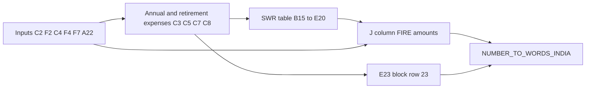

# Plan artifact storage

- **Folder:** [`docs/plans/`](.)
- **Naming:** `<short-slug>-YYYY-MM-DD.md` — **creation date** in the filename for the plan’s first version (this file: `fire-sheet4-html-plan-2026-04-15.md`).
- **Updates:** **Replace this file** when the plan changes; rely on **git history** for diffs instead of adding new dated copies each time.

---

# Financial Goals Sheet → static web (Sheet 4 first)

## Workbook map (all sheets)

| Sheet (tab) | File | Role (from XML + formulas) |
|-------------|------|----------------------------|
| **Goals** | `xl/worksheets/sheet1.xml` | Goal list: per-row cost, target year, segment inflation; **Duration** `= Achieve_by − P3`; **Value after inflation** `fv(G/100, Duration, 0, −Cost)`; **Annual investment** `PMT(10%, Duration, 0, −Value)`; **monthly SIP** `Annual/12`; totals and a side calc `C4/10*12*25`. ~24 formulas. |
| **Retirement** | `xl/worksheets/sheet2.xml` | Retirement planning: annual expense `C2*12`, current year `YEAR(TODAY())`, year-by-year **FV** of expenses with inflation through planning horizon; link text to external calculators. ~7 formulas. |
| **Sheet3** | `xl/worksheets/sheet3.xml` | Long year grid (~1001 rows): expense projection `150000*(1+10%)^(Year−2024)`, present-value style columns, annual total `*12`, `SUM` block. ~6 formulas (sparse storage). |
| **Sheet4** | `xl/worksheets/sheet4.xml` | **FIRE calculator** (this release). See below. |

**Deliverable (documentation):** add a single markdown file such as [`docs/excel-workbook-overview.md`](../excel-workbook-overview.md) with the table above, plus one subsection per sheet listing purpose, main inputs/outputs, and formula categories (full formula inventory optional for Goals/Retirement/Sheet3 when implementing those tabs later).

---

## Sheet 4 — deep understanding

### Purpose

Single-page **FIRE** (Financial Independence, Retire Early) scenario calculator for India:

- Inflates **monthly/annual expenses** from “start year” to “retirement year” using **inflation %**.
- Builds **FIRE corpus** targets (Lean / Barista / Coast / Standard / Chubby / Fat / Obese / Safe variants) from a **standard FIRE corpus** (4% rule row).
- **SWR table**: withdrawal rates 2%–5% → multiplier `100/SWR` × annual expense at retirement → corpus and **Indian English** words.
- **Custom “Expected CAGR”** block: compares a user **nominal CAGR** to inflation; uses **spread** `A22 − F4` as an implied divisor (same pattern as SWR multiplier) to show an alternate corpus.

### User-editable cells (green border)

In the workbook, **style index 13** maps to **borderId 1** with thick borders **`rgb FF38761D`** (dark green). Only these six cells use that style:

| Cell | Role | Default (cached) |
|------|------|------------------|
| **C2** | Monthly expense | 100000 |
| **F2** | Years to retirement | 10 |
| **C4** | Start year | 2024 |
| **F4** | Inflation % (annual) | 6 |
| **F7** | Expected CAGR % (used in Coast FIRE) | 10 |
| **A22** | “Expected CAGR” for custom scenario | 10 |

All other numbers on this sheet are labels, formulas, or static annotations (e.g. column **M** “9.5cr”, “6.5cr” are text hints, not computed).

### Formula inventory (28 in file)

**Core timeline and expenses**

- `C3` = `C2*12` — annual expense today.
- `C5` = `C4+F2` — retirement calendar year.
- `C7` = `ROUND(C2*(1+F4/100)^F2, 0)` — monthly expense in retirement year (Excel `ROUND`; implement as round half away from zero or `Math.round` for integers).
- `C8` = `ROUND(C3*(1+F4/100)^F2, 0)` — annual expense in retirement year.

**FIRE corpus column (J)**

- `J7` = `E19` — Standard FIRE uses **4% SWR** row total corpus.
- `J4` = `0.75*J7` (Lean), `J5` = `J7/2` (Barista), `J6` = `J7/(1+F7/100)^F2` (Coast), `J8` = `1.75*J7`, `J9` = `3*J7`, `J10` = `5*J7`.
- `J11` = `E18` — Safe FIRE 3.5%.
- `J12` = `E17` — Safe FIRE 3% (matches 3% row, not E19 despite label text in **I12** saying “cell E19” — treat **formula** as source of truth).

**SWR table (rows 15–20)**

- `C15` = `100/B15` (multiplier); same pattern for concept on row 23 via `C23` = `100/B23`.
- `D15:D20` = `C8` (each row: annual expense at retirement).
- `E15` = `D15*C15`; **`E16:E20`** should follow **`E16` = `D16*C16`**, … (stored as values in Excel; recompute in JS).
- `G15` = `NUMBER_TO_WORDS_INDIA(E15)`; **`G16:G20`** same for **`E16:E20`** (stored as static strings in Excel; recompute).

**Indian words column (K)**

- Only **K4** stores `NUMBER_TO_WORDS_INDIA(J4)` in XML; **K5:K12** are **plain text** in the file. For the web app, compute **`NUMBER_TO_WORDS_INDIA(Jn)`** for **K4–K12** whenever **Jn** is defined.

**Custom CAGR block (row 23)**

- `B23` = `A22-F4` (spread: nominal CAGR minus inflation — used as divisor analog).
- `C23` = `100/B23`.
- `D23` = `C8`.
- `E23` = `D23*C23`.
- `G23` = `NUMBER_TO_WORDS_INDIA(E23)`.

### Custom function: `NUMBER_TO_WORDS_INDIA`

Referenced in formulas but **not** embedded as VBA in this `.xlsx` (no `vbaProject.bin`). Implement in JS:

- Convert integer rupees to **Indian numbering** (lakhs, crores) in **English words**, matching the spirit of existing strings (e.g. “five crore thirty seven lakh …”).
- Fix Excel’s occasional **“undefined”** artifact in cached K-cells by robust handling of fractional paise / rounding.

### Data flow (Sheet 4)

---

## Implementation plan (static HTML + JS)

### Scope

- **Phase 1 (this task):** Sheet4 only — one static page, no build step unless you prefer one later.
- **Phase 2 (later):** Port Goals, Retirement, Sheet3 using the overview MD as spec.

### Suggested files

- [`index.html`](../../index.html) or [`sheet4-fire.html`](../../sheet4-fire.html) — structure, semantic sections (inputs, summary, FIRE types, SWR table, custom CAGR).
- [`css/styles.css`](../../css/styles.css) — typography, spacing, card layout, responsive tables, **green border** on inputs (CSS `outline` or `box-shadow` matching `#38761D`).
- [`js/sheet4.js`](../../js/sheet4.js) — state, pure formula functions, `recalculate()`, URL sync, localStorage, export helpers.

### Phase 1 enhancements (confirmed)

- **Persist inputs:** `localStorage` + explicit **Reset to defaults** (Excel baseline values).
- **Shareable URL:** Serialize the six inputs into **query parameters** (or a compact hash); parse on load and hydrate fields before first calc (avoid leaking unnecessary data in URL — numbers only).
- **Export / print:** `@media print` styles; optional **Copy summary** or **CSV** of SWR table; ensure readable print without heavy chrome.
- **Dark mode:** Respect `prefers-color-scheme` and a **manual toggle** (persist preference in `localStorage`).
- **Column M hints:** Show optional **ballpark “₹ cr”** labels beside FIRE rows to mirror Excel column **M** annotations.
- **Accessibility:** Correct `<label>`/`for`, focus order, table `<caption>` or `aria-label`, contrast in both themes, keyboard-usable controls.

### UI/UX

- **Hero / title** + short explanation of FIRE and assumptions.
- **Input panel**: six fields with labels mirroring **B2, E2, B4, E4, E7, A21** text; show units (₹, years, %).
- **Results**: two-column layout on desktop — left: key metrics (C3, C5, C7, C8); right: FIRE type cards or table (**H4:K10**).
- **SWR table**: sortable-styled table for **B15:G20** + **H19** note for STD FIRE.
- **Custom row**: **A21–G23** as a compact card.
- Use a cohesive palette (e.g. deep green accent aligned with Excel borders, neutrals, readable tables). No framework required; vanilla CSS is enough.

### Testing / parity

- Manual check: set defaults to Excel values and compare **C5, C7, C8, J4–J12, E15–E20, E23** to the workbook.
- Edge cases: `B23 = 0` or negative (invalid spread) — show a clear message and avoid divide-by-zero.

### Documentation step

- After implementation approval, **write** [`docs/excel-workbook-overview.md`](../excel-workbook-overview.md) with: sheet index, Sheet4 formula list (this plan can be pasted/adapted), and short notes for the other three sheets for future ports.

---

## Later enhancements (not in Phase 1)

| Item | Notes |
|------|--------|
| **Automated tests** | Vitest or Node assertions for pure formula functions |
| **i18n** | Hindi / other locales (number-to-words may stay English for rupees unless you add Indic numerals) |

---

## Resolved decisions

- **Plan file updates:** Replace the canonical plan in `docs/plans/`; use **git** for history (no new dated file per edit).
- **Phase 1 scope:** Persist + URL + export/print + dark mode + column M hints + accessibility (see **Phase 1 enhancements** above).
